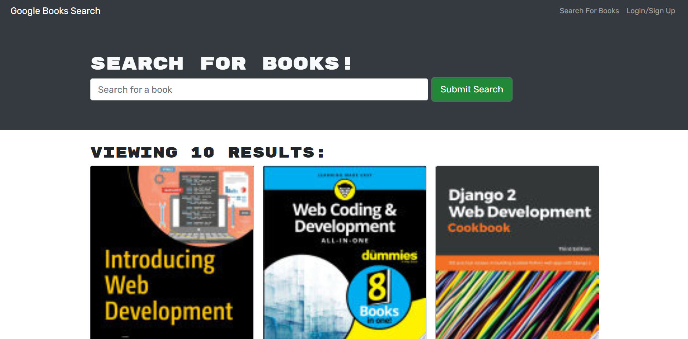

# book-search-engine

Application that allows user to search any book using Google Books API and save books and delete books from their list. Initial codebase was build with a RESTful API, and code was refactor to use GraphQL API build with Apollo server.
Tha app was build using MERN stack, with React front end, MongoDB database and Node.js/Express.js server and API. 

## Build With 
* React.js
* Node.js
* Express.js
* MongoDB
* Apollo Server
* CSS
* Bootstrap
* JavaScript

## Installation
* Installation: npm install
* In the project directory: npm start
* Start react and server: npm run develop
* Local development: Open http://localhost:3000 to view it in the browser
* GraphQl Playground: Open http://localhost:3001/graphql

## App link
https://immense-garden-40564.herokuapp.com/

## App

## By
Chaitali Patel
